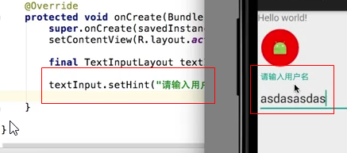

###FloatingActionButton
          
app:backgroundTint="#232323": //设置背景色   
    
app:fabSize="";//可选值为mini何normal(默认)

app:evevation="2dp";//设置阴影

app:rippleColor="";//设置点击按钮时的颜色

TextInputLayout(让EditText更加人性化)

里面必须放一个ET

app\src\main\res\mipmap-hdpi\c1.png

